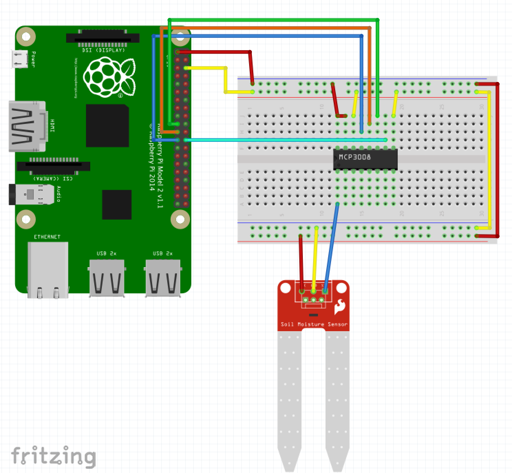
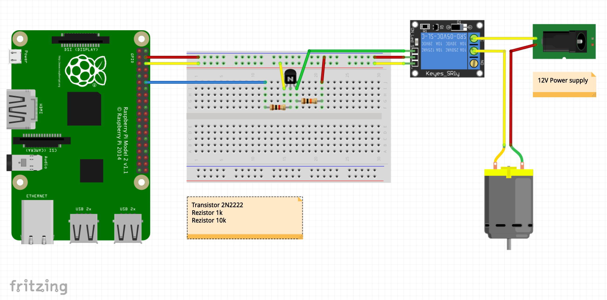

# Programmers' Week - Presentation Demo - Embedded App

## See the associated Web App for this project

  * [Programmers' Week - Web App](https://github.com/lucianleustean/pw_demo_web)

## Hardware requirements:

  * RaspberryPi (tested with v2)
  * microSD card
  * Moisture sensor
  * MCP3008 chip
  * Water pump
  * Relay
  * Transistor 2N2222
  * Rezistor 1k
  * Resistor 10k
  * Wires

## Wiring Moisture sensor

## Wiring Water Pump

## Targets

Nerves applications produce images for hardware targets based on the
`MIX_TARGET` environment variable. If `MIX_TARGET` is unset, `mix` builds an
image that runs on the host (e.g., your laptop). This is useful for executing
logic tests, running utilities, and debugging. Other targets are represented by
a short name like `rpi3` that maps to a Nerves system image for that platform.
All of this logic is in the generated `mix.exs` and may be customized. For more
information about targets see:

https://hexdocs.pm/nerves/targets.html#content

## Requirements

Setup a MQTT server locally (e.g. VerneMQ) or use a hosted one (e.g. CloudMQTT)

  * update `config/config.exs` or
  * export MQTT_USERNAME="username" MQTT_PASSWORD="password"

## Getting Started

To start your Nerves app:
  * `export MIX_TARGET=my_target` or prefix every command with
    `MIX_TARGET=my_target`. For example, `MIX_TARGET=rpi3`
  * Install dependencies with `mix deps.get`
  * Create firmware with `mix firmware`
  * Burn to an SD card with `mix firmware.burn`

## Learn more

  * Official docs: https://hexdocs.pm/nerves/getting-started.html
  * Official website: https://nerves-project.org/
  * Forum: https://elixirforum.com/c/nerves-forum
  * Discussion Slack elixir-lang #nerves ([Invite](https://elixir-slackin.herokuapp.com/))
  * Source: https://github.com/nerves-project/nerves
